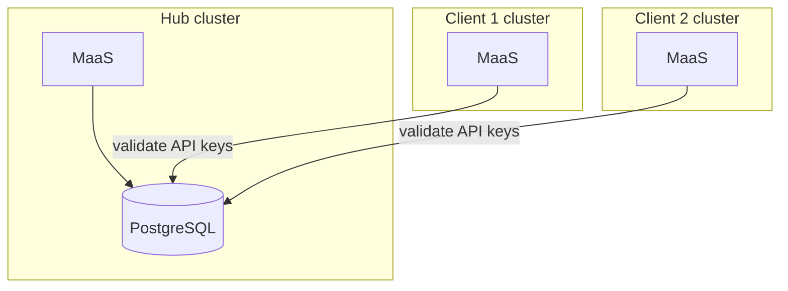

# Multi-Cluster MaaS PoC

Proof-of-concept for **shared API key storage** across three OpenShift clusters using **RHOAI 3.4** (operator-managed MaaS).

| Cluster | Role |
|---------|------|
| **hub** | PostgreSQL + key minting + same simulator models/subscriptions as clients |
| **client1**, **client2** | Inference + maas-api, shared hub DB for API key validation |

**What this proves:** mint an API key on the hub → use it for inference on client clusters when subscription names match.

> **Demo only.** Ephemeral PostgreSQL, public Route, hardcoded demo password in manifests. Not for production.

See [SPEC.md](SPEC.md) for design decisions.

## Architecture



All three clusters run MaaS. PostgreSQL lives on the hub; client clusters validate **MaaS API keys** (`sk-oai-*`) against it.

**Authentication:** OpenShift tokens from `oc whoami -t` are **cluster-local** — use the kubeconfig for the cluster you are calling (hub token on hub, client token on each client). Only **minted MaaS API keys** are shared across clusters via hub PostgreSQL.

---

## Prerequisites

- Three blank OpenShift clusters (RHOAI 3.4 compatible — OCP 4.16+)
- `oc`, `helm`, `kustomize`, `jq`, `curl` on your workstation
- Cluster-admin on each cluster
- This repo cloned locally
- Client clusters can reach the hub **postgres-hub** Route on port **443**

---

## Quick start (orchestrated)

Each cluster gets its own kubeconfig file under `/tmp`. Log in with the API token from the
OpenShift console (**Copy login command**), then run the install script for that cluster.

```bash
cd multicluster-poc
```

### 1. Hub

```bash
mkdir -p /tmp/hub
export HUB_KUBECONFIG=/tmp/hub/kubeconfig

oc login \
  --token=sha256~YOUR_HUB_TOKEN \
  --server=https://api.YOUR_HUB_CLUSTER.p3.openshiftapps.com:443 \
  --kubeconfig="${HUB_KUBECONFIG}"

./scripts/install-hub.sh --kubeconfig "${HUB_KUBECONFIG}"
```

This installs RHOAI, RHCL, GitOps (with Argo apps), Postgres, gateway, MaaS, and the
simulator models/subscriptions. Expect **30–60+ minutes** on a fresh cluster.

### 2. Client 1

Switch to the client cluster token and server. Keep `HUB_KUBECONFIG` from step 1 — the
client install reads the hub Postgres Route from it.

```bash
mkdir -p /tmp/client1
export CLIENT1_KUBECONFIG=/tmp/client1/kubeconfig

oc login \
  --token=sha256~YOUR_CLIENT1_TOKEN \
  --server=https://api.client-1.072j.p3.openshiftapps.com:443 \
  --kubeconfig="${CLIENT1_KUBECONFIG}"

./scripts/install-client.sh \
  --kubeconfig "${CLIENT1_KUBECONFIG}" \
  --hub-kubeconfig "${HUB_KUBECONFIG}" \
  --cluster client1
```

### 3. Client 2 (optional)

```bash
mkdir -p /tmp/client2
export CLIENT2_KUBECONFIG=/tmp/client2/kubeconfig

oc login \
  --token=sha256~YOUR_CLIENT2_TOKEN \
  --server=https://api.YOUR_CLIENT2_CLUSTER.p3.openshiftapps.com:443 \
  --kubeconfig="${CLIENT2_KUBECONFIG}"

./scripts/install-client.sh \
  --kubeconfig "${CLIENT2_KUBECONFIG}" \
  --hub-kubeconfig "${HUB_KUBECONFIG}" \
  --cluster client2
```

### 4. Validate

```bash
./scripts/validate-poc.sh \
  --hub-kubeconfig "${HUB_KUBECONFIG}" \
  --client-kubeconfig "${CLIENT1_KUBECONFIG}"
```

### Day-2 commands (single cluster)

After login, point `oc` at the kubeconfig you care about:

```bash
export KUBECONFIG="${HUB_KUBECONFIG}"    # or CLIENT1_KUBECONFIG
oc whoami
oc get maassubscription,maasmodelref -A
oc get applications -n openshift-gitops
```

Re-run a failed step without redoing the full install, for example:

```bash
./scripts/setup-gateway.sh --kubeconfig "${HUB_KUBECONFIG}"
./scripts/apply-models.sh --kubeconfig "${CLIENT1_KUBECONFIG}"
```

---

## Manual step-by-step

Run on each cluster unless noted.

### Phase 0 — All clusters

```bash
./scripts/install-rhoai.sh --kubeconfig "${KUBECONFIG}"
```

Optional GitOps (enabled by default in `install-hub.sh` / `install-client.sh`):

```bash
./scripts/bootstrap-gitops.sh --cluster hub --kubeconfig "${HUB_KUBECONFIG}"
```

### Phase 1 — Hub only

```bash
./scripts/install-rhcl.sh --kubeconfig "${HUB_KUBECONFIG}"
./scripts/apply-hub-postgres.sh --kubeconfig "${HUB_KUBECONFIG}"
./scripts/setup-gateway.sh --kubeconfig "${HUB_KUBECONFIG}"
./scripts/enable-maas.sh --kubeconfig "${HUB_KUBECONFIG}"
./scripts/apply-models.sh --kubeconfig "${HUB_KUBECONFIG}"
```

Argo CD Applications (`maas-poc-hub-postgres`, `maas-poc-models`) are created automatically
when using `install-hub.sh` or `bootstrap-gitops.sh` (default git repo is this project).

### Phase 2 — Each client

```bash
./scripts/setup-gateway.sh --kubeconfig "${CLIENT_KUBECONFIG}"
./scripts/sync-hub-db-to-clients.sh \
  --hub-kubeconfig "${HUB_KUBECONFIG}" \
  --client-kubeconfig "${CLIENT_KUBECONFIG}" \
  --test-connection
./scripts/enable-maas.sh --kubeconfig "${CLIENT_KUBECONFIG}"
./scripts/apply-models.sh --kubeconfig "${CLIENT_KUBECONFIG}"
```

### Phase 3 — Validate

```bash
./scripts/validate-poc.sh \
  --hub-kubeconfig "${HUB_KUBECONFIG}" \
  --client-kubeconfig "${CLIENT_KUBECONFIG}"
```

---

## Models and subscriptions

Identical on every client cluster (vendored from maas-billing samples):

| Sample | Model | Subscription | Group |
|--------|-------|--------------|-------|
| free | `facebook-opt-125m-simulated` | `simulator-subscription` | `system:authenticated` |
| premium | `premium-simulated-simulated-premium` | `premium-simulator-subscription` | `premium-user` |

Mint on the hub with the **hub** OpenShift token (stored key is shared to clients via PostgreSQL):

```bash
export KUBECONFIG="${HUB_KUBECONFIG}"
HOST="maas.$(oc get ingresses.config/cluster -o jsonpath='{.spec.domain}')"
curl -skS -X POST \
  -H "Authorization: Bearer $(KUBECONFIG="${HUB_KUBECONFIG}" oc whoami -t)" \
  -H "Content-Type: application/json" \
  -d '{"name":"demo","subscription":"simulator-subscription","expiresIn":"2h"}' \
  "https://${HOST}/maas-api/v1/api-keys"
```

Gateway host: `maas.<cluster-ingress-domain>`.

---

## Layout

```
multicluster-poc/
├── helm/gitops-bootstrap/     # OpenShift GitOps operator + optional Argo Applications
├── kustomize/
│   ├── hub/postgres/          # Hub DB + Route
│   ├── common/models/         # Simulator bundles (hub + clients)
│   └── client/argocd-apps/
├── samples/                   # Vendored model/MaaS YAML
└── scripts/                   # Install, sync, validate
```

---

## Hub PostgreSQL connectivity

- **In-cluster (hub maas-api):** `postgres.postgres.svc:5432`
- **Cross-cluster (clients):** `postgres-hub` Route hostname, port **443**, TCP passthrough, `sslmode=disable`
- Default demo password: `maas-poc-demo-change-me` (override in `kustomize/hub/postgres/postgres.yaml` before deploy)

---

## Troubleshooting

| Symptom | Check |
|---------|-------|
| maas-api CrashLoop | `maas-db-config` exists; client can reach hub Route:443 |
| Inference 403 | Subscription name on key matches client `MaaSSubscription`; model Ready |
| Gateway not Programmed | Re-run `setup-gateway.sh`; check RHCL/Authorino in `kuadrant-system` |
| RHOAI not ready | `oc get dscinitialization,datasciencecluster` |

---

## GitOps note

Argo CD Applications (`maas-poc-hub-postgres`, `maas-poc-models`) sync from
[multicluster-maas-poc](https://github.com/jland-redhat/multicluster-maas-poc) on `main`.
Push manifest changes to GitHub before expecting Argo to pick them up.

---

## Non-goals

Production database, Keycloak, cross-cluster gateway mesh, hub inference workloads.
